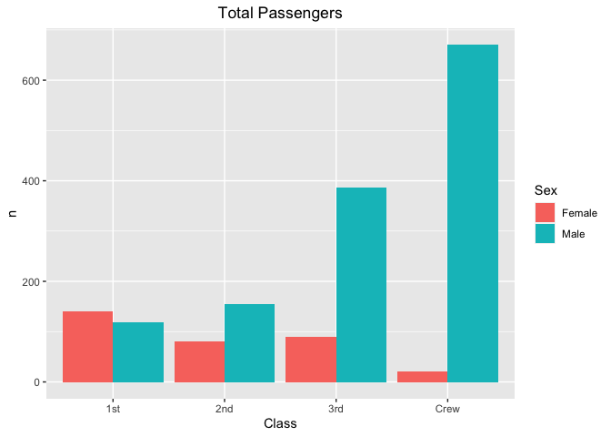
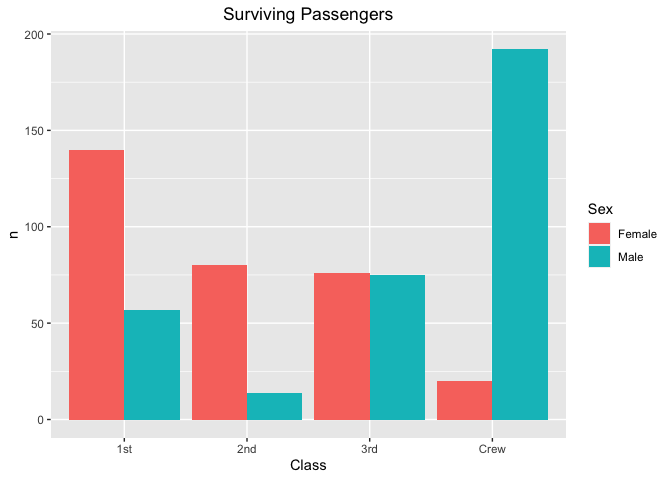
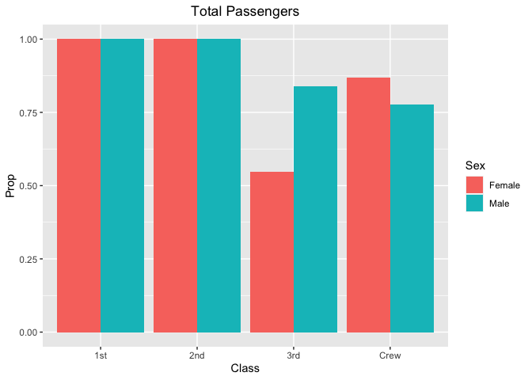
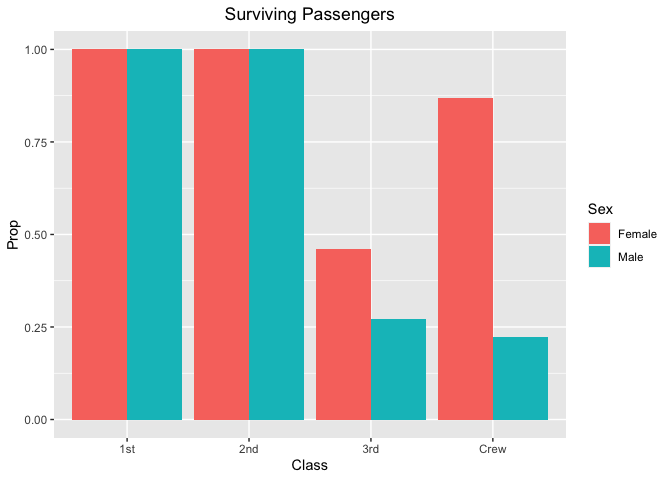
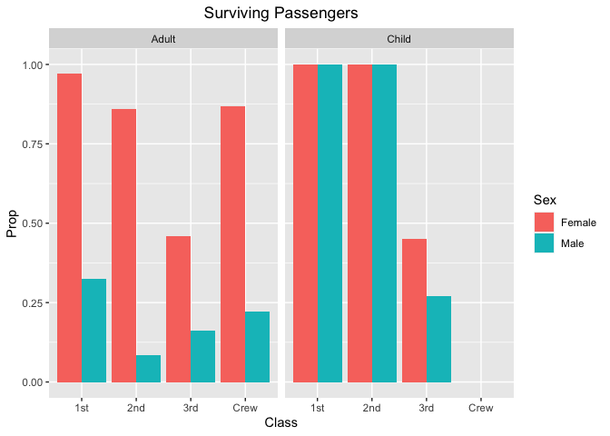
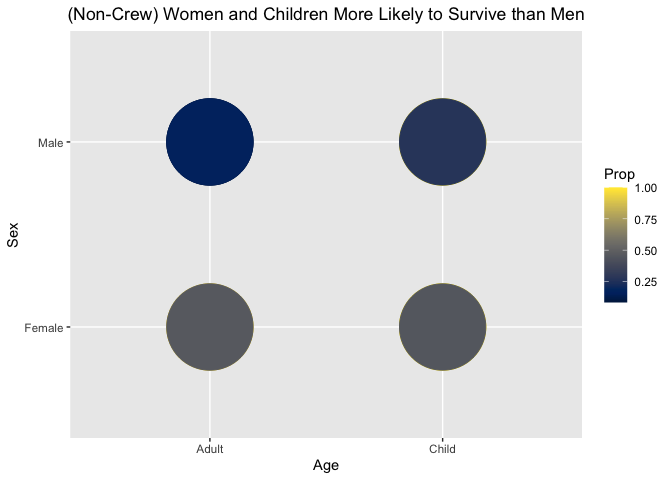

RMS Titanic
================
(Your name here)
2020-

  - [Grading Rubric](#grading-rubric)
      - [Individual](#individual)
      - [Team](#team)
      - [Due Date](#due-date)
  - [First Look](#first-look)
  - [Deeper Look](#deeper-look)
  - [Notes](#notes)

*Purpose*: Most datasets have at least a few variables. Part of our task
in analyzing a dataset is to understand trends as they vary across these
different variables. Unless we’re careful and thorough, we can easily
miss these patterns. In this challenge you’ll analyze a dataset with a
small number of categorical variables and try to find differences among
the groups.

*Reading*: (Optional) [Wikipedia
article](https://en.wikipedia.org/wiki/RMS_Titanic) on the RMS Titanic.

<!-- include-rubric -->

# Grading Rubric

<!-- -------------------------------------------------- -->

Unlike exercises, **challenges will be graded**. The following rubrics
define how you will be graded, both on an individual and team basis.

## Individual

<!-- ------------------------- -->

| Category    | Unsatisfactory                                                                   | Satisfactory                                                               |
| ----------- | -------------------------------------------------------------------------------- | -------------------------------------------------------------------------- |
| Effort      | Some task **q**’s left unattempted                                               | All task **q**’s attempted                                                 |
| Observed    | Did not document observations                                                    | Documented observations based on analysis                                  |
| Supported   | Some observations not supported by analysis                                      | All observations supported by analysis (table, graph, etc.)                |
| Code Styled | Violations of the [style guide](https://style.tidyverse.org/) hinder readability | Code sufficiently close to the [style guide](https://style.tidyverse.org/) |

## Team

<!-- ------------------------- -->

| Category   | Unsatisfactory                                                                                   | Satisfactory                                       |
| ---------- | ------------------------------------------------------------------------------------------------ | -------------------------------------------------- |
| Documented | No team contributions to Wiki                                                                    | Team contributed to Wiki                           |
| Referenced | No team references in Wiki                                                                       | At least one reference in Wiki to member report(s) |
| Relevant   | References unrelated to assertion, or difficult to find related analysis based on reference text | Reference text clearly points to relevant analysis |

## Due Date

<!-- ------------------------- -->

All the deliverables stated in the rubrics above are due on the day of
the class discussion of that exercise. See the
[Syllabus](https://docs.google.com/document/d/1jJTh2DH8nVJd2eyMMoyNGroReo0BKcJrz1eONi3rPSc/edit?usp=sharing)
for more information.

``` r
library(tidyverse)
```

    ## ── Attaching packages ────────────────────────────────────────────────────────────────────────────────────────────────────────────────────── tidyverse 1.3.0 ──

    ## ✓ ggplot2 3.3.2     ✓ purrr   0.3.4
    ## ✓ tibble  3.0.1     ✓ dplyr   1.0.0
    ## ✓ tidyr   1.1.0     ✓ stringr 1.4.0
    ## ✓ readr   1.3.1     ✓ forcats 0.5.0

    ## ── Conflicts ───────────────────────────────────────────────────────────────────────────────────────────────────────────────────────── tidyverse_conflicts() ──
    ## x dplyr::filter() masks stats::filter()
    ## x dplyr::lag()    masks stats::lag()

``` r
library(viridis)
```

    ## Loading required package: viridisLite

``` r
df_titanic <- as_tibble(Titanic)
```

*Background*: The RMS Titanic sank on its maiden voyage in 1912; about
67% of its passengers died.

# First Look

<!-- -------------------------------------------------- -->

**q1** Perform a glimpse of `df_titanic`. What variables are in this
dataset?

``` r
glimpse(df_titanic)
```

    ## Rows: 32
    ## Columns: 5
    ## $ Class    <chr> "1st", "2nd", "3rd", "Crew", "1st", "2nd", "3rd", "Crew", "1…
    ## $ Sex      <chr> "Male", "Male", "Male", "Male", "Female", "Female", "Female"…
    ## $ Age      <chr> "Child", "Child", "Child", "Child", "Child", "Child", "Child…
    ## $ Survived <chr> "No", "No", "No", "No", "No", "No", "No", "No", "No", "No", …
    ## $ n        <dbl> 0, 0, 35, 0, 0, 0, 17, 0, 118, 154, 387, 670, 4, 13, 89, 3, …

``` r
summary(df_titanic)
```

    ##     Class               Sex                Age              Survived        
    ##  Length:32          Length:32          Length:32          Length:32         
    ##  Class :character   Class :character   Class :character   Class :character  
    ##  Mode  :character   Mode  :character   Mode  :character   Mode  :character  
    ##                                                                             
    ##                                                                             
    ##                                                                             
    ##        n         
    ##  Min.   :  0.00  
    ##  1st Qu.:  0.75  
    ##  Median : 13.50  
    ##  Mean   : 68.78  
    ##  3rd Qu.: 77.00  
    ##  Max.   :670.00

**Observations**:

Variables:

  - Class (char)
  - Sex (char)
  - Age (char)
  - Survived (char)
  - n (double)

**q2** Skim the [Wikipedia
article](https://en.wikipedia.org/wiki/RMS_Titanic) on the RMS Titanic,
and look for a total count of passengers. Compare against the total
computed below. Are there any differences? Are those differences large
or small? What might account for those differences?

``` r
# Count by crew status
total_passengers <-
  df_titanic %>%
    summarize(total = sum(n))

crew_passengers <-
  df_titanic %>%
    filter(Class == "Crew") %>%
    summarize(total = sum(n))

non_crew_passengers <- total_passengers - crew_passengers

total_passengers
```

    ## # A tibble: 1 x 1
    ##   total
    ##   <dbl>
    ## 1  2201

``` r
crew_passengers
```

    ## # A tibble: 1 x 1
    ##   total
    ##   <dbl>
    ## 1   885

``` r
non_crew_passengers
```

    ##   total
    ## 1  1316

``` r
# Count by class
first_class_passengers <-
  df_titanic %>%
    filter(Class == "1st") %>%
    summarize(total = sum(n))

second_class_passengers <-
  df_titanic %>%
    filter(Class == "2nd") %>%
    summarize(total = sum(n))

third_class_passengers <-
  df_titanic %>%
    filter(Class == "3rd") %>%
    summarize(total = sum(n))

first_class_passengers
```

    ## # A tibble: 1 x 1
    ##   total
    ##   <dbl>
    ## 1   325

``` r
second_class_passengers
```

    ## # A tibble: 1 x 1
    ##   total
    ##   <dbl>
    ## 1   285

``` r
third_class_passengers
```

    ## # A tibble: 1 x 1
    ##   total
    ##   <dbl>
    ## 1   706

``` r
# Count by sex
male_non_crew_passengers <-
  df_titanic %>%
    filter(Sex == "Male", Class != "Crew") %>%
    summarize(total = sum(n))

female_non_crew_passengers <- non_crew_passengers - male_non_crew_passengers

male_non_crew_passengers
```

    ## # A tibble: 1 x 1
    ##   total
    ##   <dbl>
    ## 1   869

``` r
female_non_crew_passengers
```

    ##   total
    ## 1   447

``` r
# Count by age
child_passengers <-
  df_titanic %>%
    filter(Age == "Child") %>%
    summarize(total = sum(n))

third_class_child_passengers <-
  df_titanic %>%
    filter(Age == "Child", Class == "3rd") %>%
    summarize(total = sum(n))

child_passengers
```

    ## # A tibble: 1 x 1
    ##   total
    ##   <dbl>
    ## 1   109

``` r
third_class_child_passengers
```

    ## # A tibble: 1 x 1
    ##   total
    ##   <dbl>
    ## 1    79

**Observations**:

  - From the Wikipedia page:
      - “Titanic had around **885** crew members on board for her maiden
        voyage.”
      - “Titanic’s passengers numbered approximately **1,317** people:
        **324** in First Class, **284** in Second Class, and **709** in
        Third Class. Of these, **869** (66%) were male and **447** (34%)
        female. There were **107** children aboard, the largest number
        of whom were in Third Class.”
  - The total number of passengers in the dataset (**2201**) is just one
    less than the total according to Wikipedia (885 crew + 1317 non-crew
    = **2202**).
      - The number of crew members in the dataset (**885**) is the same
        as Wikipedia, so that means there is one non-crew passenger
        missing from the dataset.
  - The number of First Class (**325**), Second Class (**285**), and
    Third Class (**706**) passengers in the dataset is only slightly
    different from Wikipedia.
      - The difference includes the one missing passenger we already
        know about and suggests that two additional passengers are
        miscategorized.
  - The number of male (**869**) and female (**447**) non-crew
    passengers in the dataset is exactly the same as on Wikipedia.
  - The number of children (**109**) in the dataset is slightly
    different from Wikipedia.
      - This suggests that two passengers are miscategorized as
        children, or perhaps the age cut-off is different for each
        source.
      - Wikipedia also says that the largest number of children were in
        Third Class. That holds true in the dataset (79/109 =
        **72.5%**).

**q3** Create a plot showing the count of passengers who *did* survive,
along with aesthetics for `Class` and `Sex`. Document your observations
below.

*Note*: There are many ways to do this.

``` r
# Total
df_titanic %>%
  ggplot() +
    geom_col(aes(x = Class, y = n, fill = Sex), position = "dodge") +
    ggtitle("Total Passengers") +
    theme(plot.title = element_text(hjust = 0.5))
```

<!-- -->

``` r
# Survived only
df_titanic %>%
  filter(Survived == "Yes") %>%
  ggplot() +
    geom_col(aes(x = Class, y = n, fill = Sex), position = "dodge") +
    ggtitle("Surviving Passengers") +
    theme(plot.title = element_text(hjust = 0.5))
```

<!-- -->

**Observations**:

  - Many more male crew members survived than female crew members.
      - This is because there were many more male crew members in total.
  - In First and Second class, many more women survived than men.
      - This can’t be explained by total number, because there were more
        men than women in these classes.
      - Likely, this can be explained by this tidbit from Wikipedia: “A
        disproportionate number of men were left aboard because of a
        ‘women and children first’ protocol for loading lifeboats.”
  - In Third class, the numbers are about the same.
      - From Wikipedia, regarding the lifeboats: “Third-class passengers
        were largely left to fend for themselves, causing many of them
        to become trapped below decks as the ship filled with water.”
      - Because the Third Class passengers were not following the “women
        and children first” lifeboat protocol, the survivors were not
        disproportionately women.

# Deeper Look

<!-- -------------------------------------------------- -->

Raw counts give us a sense of totals, but they are not as useful for
understanding differences between groups. This is because the
differences we see in counts could be due to either the relative size of
the group OR differences in outcomes for those groups. To make
comparisons between groups, we should also consider *proportions*.\[1\]

The following code computes proportions within each `Class, Sex, Age`
group.

``` r
## NOTE: No need to edit! We'll cover how to
## do this calculation in a later exercise.
df_prop <-
  df_titanic %>%
  group_by(Class, Sex, Age) %>%
  mutate(
    Total = sum(n),
    Prop = n / Total
  ) %>%
  ungroup()
df_prop
```

    ## # A tibble: 32 x 7
    ##    Class Sex    Age   Survived     n Total    Prop
    ##    <chr> <chr>  <chr> <chr>    <dbl> <dbl>   <dbl>
    ##  1 1st   Male   Child No           0     5   0    
    ##  2 2nd   Male   Child No           0    11   0    
    ##  3 3rd   Male   Child No          35    48   0.729
    ##  4 Crew  Male   Child No           0     0 NaN    
    ##  5 1st   Female Child No           0     1   0    
    ##  6 2nd   Female Child No           0    13   0    
    ##  7 3rd   Female Child No          17    31   0.548
    ##  8 Crew  Female Child No           0     0 NaN    
    ##  9 1st   Male   Adult No         118   175   0.674
    ## 10 2nd   Male   Adult No         154   168   0.917
    ## # … with 22 more rows

**q4** Replicate your visual from q3, but display `Prop` in place of
`n`. Document your observations, and note any new/different observations
you make in comparison with q3.

``` r
df_prop %>%
  ggplot() +
    geom_col(aes(x = Class, y = Prop, fill = Sex), position = "dodge") +
    ggtitle("Total Passengers") +
    theme(plot.title = element_text(hjust = 0.5))
```

    ## Warning: Removed 4 rows containing missing values (geom_col).

<!-- -->

``` r
df_prop %>%
  filter(Survived == "Yes") %>%
  ggplot() +
    geom_col(aes(x = Class, y = Prop, fill = Sex), position = "dodge") +
    ggtitle("Surviving Passengers") +
    theme(plot.title = element_text(hjust = 0.5))
```

    ## Warning: Removed 2 rows containing missing values (geom_col).

<!-- -->

**Observations**:

  - These plots don’t really make sense as-is? I can’t fgure out exactly
    why, but I think they need to be broken out by Age in additon to
    Class and Sex.

**q5** Create a plot showing the group-proportion of passengers who
*did* survive, along with aesthetics for `Class`, `Sex`, *and* `Age`.
Document your observations below.

*Hint*: Don’t forget that you can use `facet_grid` to help consider
additional variables\!

``` r
df_prop %>%
  filter(Survived == "Yes") %>%
  ggplot() +
    geom_col(aes(x = Class, y = Prop, fill = Sex), position = "dodge") +
    facet_grid(cols = vars(Age)) +
    ggtitle("Surviving Passengers") +
    theme(plot.title = element_text(hjust = 0.5))
```

    ## Warning: Removed 2 rows containing missing values (geom_col).

<!-- -->

**Observations**:

  - This makes more sense than the plots for q4\!
  - Here, we can clearly see that in the First and Second Classes (and
    among the Crew), all of the children and the majority of the women
    survived.
  - We can also see that in Third Class, where they did not have the
    same access to lifeboats, significantly smaller proportions of women
    and children survived.

**Bonus**

``` r
df_prop %>%
  filter(Class != "Crew", Survived == "Yes") %>%
  ggplot() +
    geom_point(mapping = aes(x = Age, y = Sex, color = Prop), size = 30) +
    scale_color_viridis(option = "cividis") +
    ggtitle("(Non-Crew) Women and Children More Likely to Survive than Men") +
    theme(plot.title = element_text(hjust = 0.5))
```

<!-- -->

**Observations**:

  - Trying out another visualization to show that, across the passenger
    classes, more women and children survived than men.

# Notes

<!-- -------------------------------------------------- -->

\[1\] This is basically the same idea as [Dimensional
Analysis](https://en.wikipedia.org/wiki/Dimensional_analysis); computing
proportions is akin to non-dimensionalizing a quantity.
